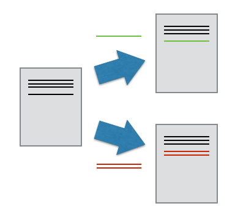
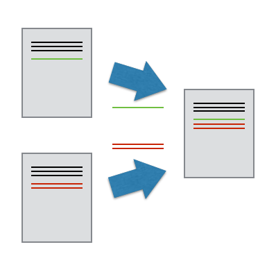
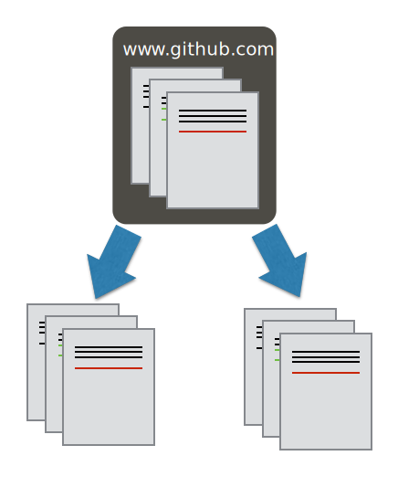
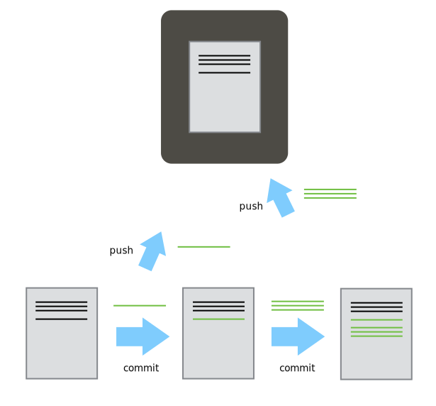
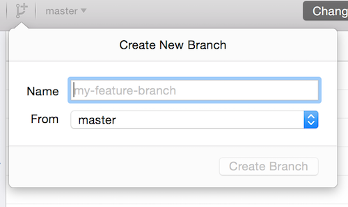

> ## Learning Objectives {.objectives}
>
> *   Discuss what version control is and how it works.
> *   Explain how Git and distributed version control works.
> *   Go through the modify-add-commit cycle for single and multiple files
>     and explain where information is stored at each stage.
> *   Discuss how branching works.
> *   Identify and use Git revision numbers.
> *   Compare files with old versions of themselves.
> *   Restore old versions of files.
> *   Configure Git to ignore specific files,
>     and explain why it is sometimes useful to do so.

## What is version control and how does it work?

Before we start, has everyone downloaded and installed the Github app? Let's do that now.

"Piled Higher and Deeper" by Jorge Cham, http://www.phdcomics.com

We've all been in this situation before: it seems ridiculous to have multiple nearly-identical versions of the same document. Some word processors let us deal with this a little better, like Microsoft Word ("Track Changes") or Google Docs version history.

Version control systems start with a base version of the document and then save just the changes you made at each step on the way. You can think of it as a tape: if you rewind the tape and start at the base document, then you can play back each change and end up with your latest version.

Once you think of changes as separate from the document itself, you can then think about "playing back" different sets of changes onto the base document and getting different versions of the document. For example, two users can make independent sets of changes based on the same document.

If there aren't conflicts, you can even try to play two sets of changes onto the same base document.

## How Git works

A version control system is a tool that keeps track of these changes for us and helps us version and merge our files. A system like Git is designed to keep multiple sets of versions and changes in sync across different computers or servers. This is called a _distributed_ system.

A [repository](reference.html#repository) is the set of files that we want to keep under version control.

With Git, every user who wants to make changes to a repository has their own copy of the files in the repository, along with their own copy of the changes (the _commits_) that have been made to those files. Git keeps the commits in a secret directory along with the copies of the files.

A service like Github acts as a central server for your repository, but it is basically just storing another copy of your repository. Github's copies are only special because we told Git that the Github version is special.

So, if a user wants to make changes to a file in a repo that is under Git control, she can make changes to her own copy of the file and then tell Git to save those changes in its  history. This is called _committing_ the changes, and it saves the changes in her own copy of the repo on her own computer.

If she wants another user to see her changes, though, she needs to tell that other user's Git copy that she made changes. This is called _pushing_ the commits to another repo. She can either push the changes directly to another user's copy, or she can push them to a centrally-designated remote repository, like one at Github.

Everyone has made a user account at Github, right?

We're going to do everything both through the GUI and through the command line. I want you to focus on the GUI and the actual operations we're performing, because you can always look up what the correct command is later.

## Setting Up

The first time we use Git on a new machine, we need to make sure Git knows a few things. We can configure some basic settings with `git config`:

~~~ {.bash}
$ git config --global user.name "Vlad Dracula"
$ git config --global user.email "vlad@tran.sylvan.ia"
$ git config --global color.ui "auto"
$ git config --global core.editor "nano"
~~~

(Please use your own name and email address instead of Dracula's,
and please make sure you choose an editor that's actually on your system,
such as `notepad` on Windows.)

Git commands are written `git verb`,
where `verb` is what we actually want it to do.
In this case,
we're telling Git:

*   our name and email address,
*   to colorize output,
*   what our favorite text editor is, and
*   that we want to use these settings globally (i.e., for every project),

The four commands above only need to be run once:
the flag `--global` tells Git to use the settings for every project on this machine.

## Start Version Control

Let's create a directory for our work. Create a new folder in your home directory and call it `planets_yourname`, open a terminal window and navigate into that directory.

~~~ {.bash}
$ cd planets_yourname
~~~

and tell Git to make this directory into a repository.

~~~ {.bash}
$ git init
~~~

Git creates a hidden directory called `.git` in this directory:

~~~ {.bash}
$ ls -a
~~~
~~~ {.output}
.	..	.git
~~~

This hidden directory contains Git's history of all the changes and commits we're going to make. If we ever delete it, we will lose the project's history.

## Tracking Changes to Files

### Create a file:

Let's create a file called `mars.txt` that contains some notes
about the Red Planet's suitability as a base.

Open your favorite text editor, maybe TextWrangler on the Mac or Notepad on Windows, and start a new file. Type some text into the new file:

~~~ {.output}
Cold and dry, but everything is my favorite color
~~~

Save this file in your planets_yourname directory as `mars.txt`.

### Tracking our file:

We can look at this repo in the Github GUI app. Launch the Github app. From the File menu, go to Add Local Repository... and add the planets directory.

Now you should see your file `mars.txt` with its changes.

Remember, the Github app is just a convenient way of executing Git commands without having to use the terminal, but we should know what is going on behind the scenes too. These commands are the ones that the GUI app is running for you.

Let's ask Git about the status of this repo:

~~~ {.bash}
$ git status
~~~
~~~ {.output}
# On branch master
#
# Initial commit
#
# Untracked files:
#   (use "git add <file>..." to include in what will be committed)
#
#	mars.txt
nothing added to commit but untracked files present (use "git add" to track)
~~~

We can see that our `mars.txt` file is listed as an "untracked file." We can tell Git that it should track this file using `git add`:

~~~ {.bash}
$ git add mars.txt
~~~

### Committing for the first time:

Now let's commit this file into our repo for the first time.

We can do this from the app. Type a commit message into the Summary box:

This message describes what our current set of changes did so we can figure it out two months from now.

Press the Commit button to commit these changes.

Or we can do this from the command line:

~~~ {.bash}
$ git commit -a -m "Starting to think about Mars"
~~~
~~~ {.output}
[master (root-commit) 189f6e7] Starting to think about Mars
 1 file changed, 1 insertion(+)
 create mode 100644 mars.txt
~~~

Git takes all the changes we made this time and stores a record of those changes permanently inside the special `.git` directory. This set of changes is called a [revision](reference.html#revision). It assigns a unique identifier (`f22b25e`) to the commit.

> ## What are the flags for? {.callout}
>
> We use the `-m` flag (for "message") to record a comment that will help us remember later on what we did and why.
> If we just run `git commit` without the `-m` option, Git will launch `nano` (or whatever other editor we configured at the start) so that we can write a longer message.
> We use the `-a` flag to tell Git to commit the changes to all of our files in the repository.

### Looking at past changes:

We can look at the repo's history to see what we've done in the past.

From the command line, type `git log`:

~~~ {.bash}
$ git log
~~~
~~~ {.output}
commit 189f6e70156057a0da216b18a1bd592fd89daabf
Author: daisieh_local <daisieh@gmail.com>
Date:   Sat Feb 28 02:00:20 2015 -0800

    Starting to think about Mars
~~~

You'll see all the revisions that were made in reverse chronological order. You can see the unique identifiers for each of the commits too: notice that the short identifier that we got from the commit message is just the first seven letters of this longer identifier. Git accepts either version of the identifier.

## Branches

We could certainly use Git with just these unique identifiers as our labels for our work, and ask Git what label went with which commit went with which set. But this isn't really the way we usually work, is it?

Usually you're trying to accomplish a particular task and you know you're going to make some changes to the repository to achieve this. It'd be nice to have a human-readable label for those changes, to make it easier to visualize and to make it easier to share with others. Branches let us achieve this.

Think of the commit identifiers as our trail of breadcrumbs that we are leaving behind us as we work. When we make a branch, we are changing to a different type of breadcrumb: maybe we start dropping pieces of pumpernickel behind us instead of sourdough.

When you start your new branch `pumpernickel`, you keep the trail of commits that you made before you branched, but any new commits you make will be using the pumpernickel crumbs.

The original trail of breadcrumbs, the sourdough ones in this analogy, have the default branch name of `master`. It's a good practice to keep `master` as the base branch of all the work you do in a repository, and make new branches to do work on new subprojects.

Let's make a branch now. We want to start a new project where we compare the different planets in separate files. Switch to the Github app. Notice that right now, it tells us we're in branch `master` in several different places, and when we committed changes, the button said that we were committing to master.

Make a branch and call it `separate-files`.

Now, we can switch back to the text editor, make a new file called `jupiter.txt`. Type some text into the file and save it to our `planets_yourname` directory.

~~~ {.output}
Very attractive big red storm here.
~~~

In the Github app, commit your new file and changes to the branch `separate-files`. Now, switch branches back to `master` using the pull-down menu. You'll see that the history now reflects what we did before we made the new file. If you look inside your `planets` directory, you'll see that there is only one file now, the `mars.txt` file. If you switch branches back to `separate-files`, you should see `jupiter.txt` come back.

The command line version of this is a bit more confusing. We create a branch by calling

~~~ {.bash}
$ git branch separate-files
~~~

We list the available branches using `git branch` with no additional arguments.

~~~ {.bash}
$ git branch
~~~
~~~ {.output}
* master
  separate-files
~~~

But we're not on our new branch! In order to switch branches, we have to use `git checkout`.

~~~ {.bash}
$ git checkout separate-files
~~~
~~~ {.output}
Switched to branch 'separate-files'
~~~

Try playing around with the command line and the GUI: they should reflect the same information.

## Changing a File

Now suppose Dracula adds more information to the file.
(Again, we'll edit with `nano` and then `cat` the file to show its contents;
you may use a different editor, and don't need to `cat`.)

~~~ {.bash}
$ nano mars.txt
$ cat mars.txt
~~~
~~~ {.output}
Cold and dry, but everything is my favorite color
The two moons may be a problem for Wolfman
~~~

When we run `git status` now,
it tells us that a file it already knows about has been modified:

~~~ {.bash}
$ git status
~~~
~~~ {.output}
# On branch master
# Changes not staged for commit:
#   (use "git add <file>..." to update what will be committed)
#   (use "git checkout -- <file>..." to discard changes in working directory)
#
#	modified:   mars.txt
#
no changes added to commit (use "git add" and/or "git commit -a")
~~~

The last line is the key phrase:
"no changes added to commit".
We have changed this file,
but we haven't told Git we will want to save those changes
(which we do with `git add`)
much less actually saved them (which we do with `git commit`).
So let's do that now. It is good practice to always review
our changes before saving them. We do this using `git diff`.
This shows us the differences between the current state
of the file and the most recently saved version:

~~~ {.bash}
$ git diff
~~~
~~~ {.output}
diff --git a/mars.txt b/mars.txt
index df0654a..315bf3a 100644
--- a/mars.txt
+++ b/mars.txt
@@ -1 +1,2 @@
 Cold and dry, but everything is my favorite color
+The two moons may be a problem for Wolfman
~~~

The output is cryptic because
it is actually a series of commands for tools like editors and `patch`
telling them how to reconstruct one file given the other.
If we break it down into pieces:

1.  The first line tells us that Git is producing output similar to the Unix `diff` command
    comparing the old and new versions of the file.
2.  The second line tells exactly which revisions of the file
    Git is comparing;
    `df0654a` and `315bf3a` are unique computer-generated labels for those revisions.
3.  The third and fourth lines once again show the name of the file being changed.
4.  The remaining lines are the most interesting, they show us the actual differences
    and the lines on which they occur.
    In particular,
    the `+` markers in the first column show where we are adding lines.

After reviewing our change, it's time to commit it:

~~~ {.bash}
$ git commit -m "Concerns about Mars's moons on my furry friend"
~~~
~~~ {.output}
# On branch master
# Changes not staged for commit:
#   (use "git add <file>..." to update what will be committed)
#   (use "git checkout -- <file>..." to discard changes in working directory)
#
#	modified:   mars.txt
#
no changes added to commit (use "git add" and/or "git commit -a")
~~~

Whoops:
Git won't commit because we didn't use `git add` first.
Let's fix that:

~~~ {.bash}
$ git add mars.txt
$ git commit -m "Concerns about Mars's moons on my furry friend"
~~~
~~~ {.output}
[master 34961b1] Concerns about Mars's moons on my furry friend
 1 file changed, 1 insertion(+)
~~~

Git insists that we add files to the set we want to commit
before actually committing anything
because we may not want to commit everything at once.
For example,
suppose we're adding a few citations to our supervisor's work
to our thesis.
We might want to commit those additions,
and the corresponding addition to the bibliography,
but *not* commit the work we're doing on the conclusion
(which we haven't finished yet).

To allow for this,
Git has a special staging area
where it keeps track of things that have been added to
the current [change set](reference.html#change-set)
but not yet committed.
`git add` puts things in this area,
and `git commit` then copies them to long-term storage (as a commit):

Let's watch as our changes to a file move from our editor
to the staging area
and into long-term storage.
First,
we'll add another line to the file:

~~~ {.bash}
$ nano mars.txt
$ cat mars.txt
~~~
~~~ {.output}
Cold and dry, but everything is my favorite color
The two moons may be a problem for Wolfman
But the Mummy will appreciate the lack of humidity
~~~
~~~ {.bash}
$ git diff
~~~
~~~ {.output}
diff --git a/mars.txt b/mars.txt
index 315bf3a..b36abfd 100644
--- a/mars.txt
+++ b/mars.txt
@@ -1,2 +1,3 @@
 Cold and dry, but everything is my favorite color
 The two moons may be a problem for Wolfman
+But the Mummy will appreciate the lack of humidity
~~~

So far, so good:
we've added one line to the end of the file
(shown with a `+` in the first column).
Now let's put that change in the staging area
and see what `git diff` reports:

~~~ {.bash}
$ git add mars.txt
$ git diff
~~~

There is no output:
as far as Git can tell,
there's no difference between what it's been asked to save permanently
and what's currently in the directory.
However,
if we do this:

~~~ {.bash}
$ git diff --staged
~~~
~~~ {.output}
diff --git a/mars.txt b/mars.txt
index 315bf3a..b36abfd 100644
--- a/mars.txt
+++ b/mars.txt
@@ -1,2 +1,3 @@
 Cold and dry, but everything is my favorite color
 The two moons may be a problem for Wolfman
+But the Mummy will appreciate the lack of humidity
~~~

it shows us the difference between
the last committed change
and what's in the staging area.
Let's save our changes:

~~~ {.bash}
$ git commit -m "Thoughts about the climate"
~~~
~~~ {.output}
[master 005937f] Thoughts about the climate
 1 file changed, 1 insertion(+)
~~~

check our status:

~~~ {.bash}
$ git status
~~~
~~~ {.output}
# On branch master
nothing to commit, working directory clean
~~~

and look at the history of what we've done so far:

~~~ {.bash}
$ git log
~~~
~~~ {.output}
commit 005937fbe2a98fb83f0ade869025dc2636b4dad5
Author: Vlad Dracula <vlad@tran.sylvan.ia>
Date:   Thu Aug 22 10:14:07 2013 -0400

    Thoughts about the climate

commit 34961b159c27df3b475cfe4415d94a6d1fcd064d
Author: Vlad Dracula <vlad@tran.sylvan.ia>
Date:   Thu Aug 22 10:07:21 2013 -0400

    Concerns about Mars's moons on my furry friend

commit f22b25e3233b4645dabd0d81e651fe074bd8e73b
Author: Vlad Dracula <vlad@tran.sylvan.ia>
Date:   Thu Aug 22 09:51:46 2013 -0400

    Starting to think about Mars
~~~

To recap, when we want to add changes to our repository,
we first need to add the changed files to the staging area
(`git add`) and then commit the staged changes to the
repository (`git commit`):

## Exploring History

If we want to see what we changed when,
we use `git diff` again,
but refer to old versions
using the notation `HEAD~1`, `HEAD~2`, and so on:

~~~ {.bash}
$ git diff HEAD~1 mars.txt
~~~
~~~ {.output}
diff --git a/mars.txt b/mars.txt
index 315bf3a..b36abfd 100644
--- a/mars.txt
+++ b/mars.txt
@@ -1,2 +1,3 @@
 Cold and dry, but everything is my favorite color
 The two moons may be a problem for Wolfman
+But the Mummy will appreciate the lack of humidity
~~~
~~~ {.bash}
$ git diff HEAD~2 mars.txt
~~~
~~~ {.output}
diff --git a/mars.txt b/mars.txt
index df0654a..b36abfd 100644
--- a/mars.txt
+++ b/mars.txt
@@ -1 +1,3 @@
 Cold and dry, but everything is my favorite color
+The two moons may be a problem for Wolfman
+But the Mummy will appreciate the lack of humidity
~~~

In this way,
we build up a chain of revisions.
The most recent end of the chain is referred to as `HEAD`;
we can refer to previous revisions using the `~` notation,
so `HEAD~1` (pronounced "head minus one")
means "the previous revision",
while `HEAD~123` goes back 123 revisions from where we are now.

We can also refer to revisions using
those long strings of digits and letters
that `git log` displays.
These are unique IDs for the changes,
and "unique" really does mean unique:
every change to any set of files on any machine
has a unique 40-character identifier.
Our first commit was given the ID
f22b25e3233b4645dabd0d81e651fe074bd8e73b,
so let's try this:

~~~ {.bash}
$ git diff f22b25e3233b4645dabd0d81e651fe074bd8e73b mars.txt
~~~
~~~ {.output}
diff --git a/mars.txt b/mars.txt
index df0654a..b36abfd 100644
--- a/mars.txt
+++ b/mars.txt
@@ -1 +1,3 @@
 Cold and dry, but everything is my favorite color
+The two moons may be a problem for Wolfman
+But the Mummy will appreciate the lack of humidity
~~~

That's the right answer,
but typing random 40-character strings is annoying,
so Git lets us use just the first few:

~~~ {.bash}
$ git diff f22b25e mars.txt
~~~
~~~ {.output}
diff --git a/mars.txt b/mars.txt
index df0654a..b36abfd 100644
--- a/mars.txt
+++ b/mars.txt
@@ -1 +1,3 @@
 Cold and dry, but everything is my favorite color
+The two moons may be a problem for Wolfman
+But the Mummy will appreciate the lack of humidity
~~~

## Recovering Old Versions

All right:
we can save changes to files and see what we've changed---how
can we restore older versions of things?
Let's suppose we accidentally overwrite our file:

~~~ {.bash}
$ nano mars.txt
$ cat mars.txt
~~~
~~~ {.output}
We will need to manufacture our own oxygen
~~~

`git status` now tells us that the file has been changed,
but those changes haven't been staged:

~~~ {.bash}
$ git status
~~~
~~~ {.output}
# On branch master
# Changes not staged for commit:
#   (use "git add <file>..." to update what will be committed)
#   (use "git checkout -- <file>..." to discard changes in working directory)
#
#	modified:   mars.txt
#
no changes added to commit (use "git add" and/or "git commit -a")
~~~

We can put things back the way they were
by using `git checkout`:

~~~ {.bash}
$ git checkout HEAD mars.txt
$ cat mars.txt
~~~
~~~ {.output}
Cold and dry, but everything is my favorite color
The two moons may be a problem for Wolfman
But the Mummy will appreciate the lack of humidity
~~~

As you might guess from its name,
`git checkout` checks out (i.e., restores) an old version of a file.
In this case,
we're telling Git that we want to recover the version of the file recorded in `HEAD`,
which is the last saved revision.
If we want to go back even further,
we can use a revision identifier instead:

~~~ {.bash}
$ git checkout f22b25e mars.txt
~~~

It's important to remember that
we must use the revision number that identifies the state of the repository
*before* the change we're trying to undo.
A common mistake is to use the revision number of
the commit in which we made the change we're trying to get rid of.
In the example below, we want retrieve the state from before the most
recent commit (`HEAD~1`), which is revision `f22b25e`:

The following diagram illustrates what the history of a file might look
like (moving back from `HEAD`, the most recently committed version):

> ## Simplifying the Common Case {.callout}
>
> If you read the output of `git status` carefully,
> you'll see that it includes this hint:
>
> ~~~ {.bash}
> (use "git checkout -- <file>..." to discard changes in working directory)
> ~~~
>
> As it says,
> `git checkout` without a version identifier restores files to the state saved in `HEAD`.
> The double dash `--` is needed to separate the names of the files being recovered
> from the command itself:
> without it,
> Git would try to use the name of the file as the revision identifier.

The fact that files can be reverted one by one
tends to change the way people organize their work.
If everything is in one large document,
it's hard (but not impossible) to undo changes to the introduction
without also undoing changes made later to the conclusion.
If the introduction and conclusion are stored in separate files,
on the other hand,
moving backward and forward in time becomes much easier.

## Ignoring Things

What if we have files that we do not want Git to track for us,
like backup files created by our editor
or intermediate files created during data analysis.
Let's create a few dummy files:

~~~ {.bash}
$ mkdir results
$ touch a.dat b.dat c.dat results/a.out results/b.out
~~~

and see what Git says:

~~~ {.bash}
$ git status
~~~
~~~ {.output}
# On branch master
# Untracked files:
#   (use "git add <file>..." to include in what will be committed)
#
#	a.dat
#	b.dat
#	c.dat
#	results/
nothing added to commit but untracked files present (use "git add" to track)
~~~

Putting these files under version control would be a waste of disk space.
What's worse,
having them all listed could distract us from changes that actually matter,
so let's tell Git to ignore them.

We do this by creating a file in the root directory of our project called `.gitignore`.

~~~ {.bash}
$ nano .gitignore
$ cat .gitignore
~~~
~~~ {.output}
*.dat
results/
~~~

These patterns tell Git to ignore any file whose name ends in `.dat`
and everything in the `results` directory.
(If any of these files were already being tracked,
Git would continue to track them.)

Once we have created this file,
the output of `git status` is much cleaner:

~~~ {.bash}
$ git status
~~~
~~~ {.output}
# On branch master
# Untracked files:
#   (use "git add <file>..." to include in what will be committed)
#
#	.gitignore
nothing added to commit but untracked files present (use "git add" to track)
~~~

The only thing Git notices now is the newly-created `.gitignore` file.
You might think we wouldn't want to track it,
but everyone we're sharing our repository with will probably want to ignore
the same things that we're ignoring.
Let's add and commit `.gitignore`:

~~~ {.bash}
$ git add .gitignore
$ git commit -m "Add the ignore file"
$ git status
~~~
~~~ {.output}
# On branch master
nothing to commit, working directory clean
~~~

As a bonus,
using `.gitignore` helps us avoid accidentally adding files to the repository that we don't want.

~~~ {.bash}
$ git add a.dat
~~~
~~~ {.output}
The following paths are ignored by one of your .gitignore files:
a.dat
Use -f if you really want to add them.
fatal: no files added
~~~

If we really want to override our ignore settings,
we can use `git add -f` to force Git to add something.
We can also always see the status of ignored files if we want:

~~~ {.bash}
$ git status --ignored
~~~
~~~ {.output}
# On branch master
# Ignored files:
#  (use "git add -f <file>..." to include in what will be committed)
#
#        a.dat
#        b.dat
#        c.dat
#        results/

nothing to commit, working directory clean
~~~

> ## Committing Changes to Git {.challenge}
>
> Which command(s) below would save changes of `myfile.txt` to my local Git repository?
>
> 1. `git commit -m "my recent changes"`
> 2. `git init myfile.txt`
>    `git commit -m "my recent changes"`
> 3. `git add myfile.txt`
>    `git commit -m "my recent changes"`
> 4. `git commit -m myfile.txt "my recent changes"`

> ## Recovering Older Versions of a File {.challenge}
>
> Jennifer has made changes to the Python script that she has been working on for weeks, and the
> modifications she made this morning "broke" the script and it no longer runs. She has spent
> ~ 1hr trying to fix it, with no luck...
>
> Luckily, she has been keeping track of her revisions using Git! Which commands below will
> let her recover the last committed version of her Python script called
> `data_cruncher.py`?
>
> 1. `git checkout HEAD`
> 2. `git checkout HEAD data_cruncher.py`
> 3. `git checkout HEAD~1 data_cruncher.py`
> 4. `git checkout <unique ID of last revision> data_cruncher.py`
> 5. Both 2 & 4

> ## `bio` Repository {.challenge}
>
> Create a new Git repository on your computer called `bio`.
> Write a three-line biography for yourself in a file called `me.txt`,
> commit your changes,
> then modify one line and add a fourth and display the differences
> between its updated state and its original state.

> ## Places to Create Git Repositories {.challenge}
>
> The following sequence of commands creates one Git repository inside another:
>
> ~~~ {.bash}
> cd           # return to home directory
> mkdir alpha  # make a new directory alpha
> cd alpha     # go into alpha
> git init     # make the alpha directory a Git repository
> mkdir beta   # make a sub-directory alpha/beta
> cd beta      # go into alpha/beta
> git init     # make the beta sub-directory a Git repository
> ~~~
>
> Why is it a bad idea to do this?
