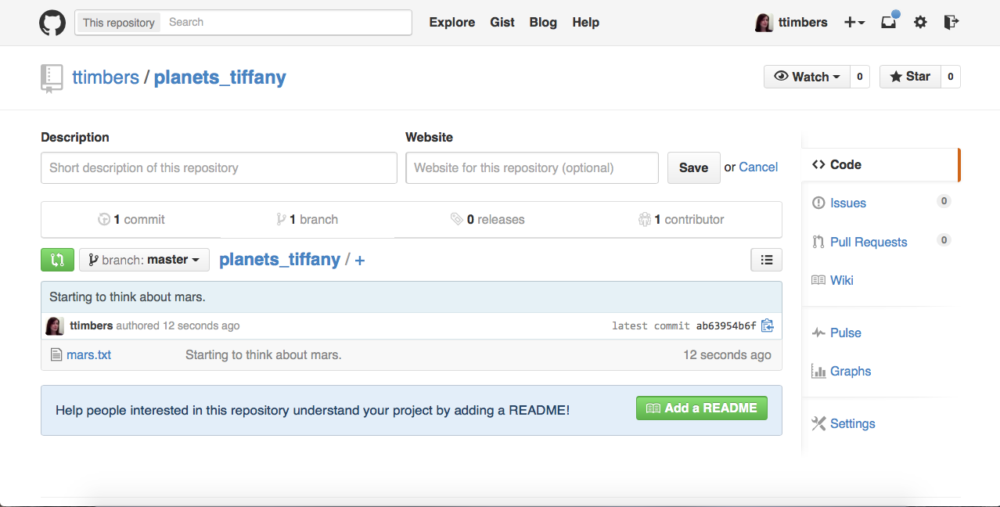
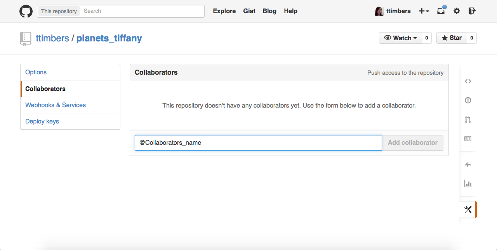

> ## Learning Objectives {.objectives}
>
> *   Explain what happens when changes are pushed to or pulled from a remote repository.
> *   Explain how to add collaborators to a repository.
> *   Explain what conflicts are and when they can occur.
> *   Resolve conflicts resulting from a merge.

> ## Practicing in pairs {.callout}
>
> Designate one partner as the repository "Owner" and one partner as the repository
> "Collaborator".

The repository "Owner" needs to grant the Collaborator access.

Owner: On GitHub, click the settings button on the right:

Owner: Select Collaborators (top left), and enter your Collaborator's username.

Collaborator: Go to your email to retrieve the `URL` to connect to the Owner's repository.

Collaborator: `cd` to another directory
(so `ls` doesn't show a `planets` folder),
and then make a copy of this repository on your own computer:

~~~ {.bash}
$ git clone URL_from_Collaborator
~~~

`git clone` creates a fresh local copy of a remote repository.

Collaborator: Make a change in their copy of the repository:

~~~ {.bash}
$ cd planets
$ nano mars.txt
$ cat mars.txt
~~~
~~~ {.output}
This is my important contribution to the collaboration!
~~~
~~~ {.bash}
$ git add mars.txt
$ git commit -m "My important contribution."
~~~
~~~ {.output}
 1 file changed, 1 insertion(+)
 create mode 100644 mars.txt
~~~

then push the change to GitHub:

~~~ {.bash}
$ git push origin master
~~~
~~~ {.output}
Counting objects: 4, done.
Delta compression using up to 4 threads.
Compressing objects: 100% (2/2), done.
Writing objects: 100% (3/3), 306 bytes, done.
Total 3 (delta 0), reused 0 (delta 0)
To https://github.com/vlad/planets.git
   9272da5..29aba7c  master -> master
~~~

Now the Owner needs to update their repository to access the changes made by the Collaborator.

Owner: retrieve the changes from Github:

~~~ {.bash}
$ git pull origin master
~~~
~~~ {.output}
remote: Counting objects: 4, done.
remote: Compressing objects: 100% (2/2), done.
remote: Total 3 (delta 0), reused 3 (delta 0)
Unpacking objects: 100% (3/3), done.
From https://github.com/vlad/planets
 * branch            master     -> FETCH_HEAD
Updating 9272da5..29aba7c
Fast-forward
 mars.txt | 1 +
 1 file changed, 1 insertion(+)
 create mode 100644 pluto.txt
~~~

Now the repositories on both the Owner's and the Collaborator's machines should be
up to date and identical. We can check that this is the case for the `mars.txt` file.

Owner & Collaborator: check the contents of `mars.txt`
~~~
cat mars.txt
~~~
~~~
Cold and dry, but everything is my favorite color
The two moons may be a problem for Wolfman
But the Mummy will appreciate the lack of humidity
This is my important contribution to the collaboration!
~~~

> ## GitHub Collaboration {.challenge}
>
> Now the repository owner should make a change to `mars.txt`, add and commit the changes
> to Git and push the changes to Github. Then the collaborator should pull the changes
> from the remote repository to their local repository. Finally, use `cat` to verify
> that both the Owner and Collaborator have the same version of the file.

> ## Hint
>
> Before teaching this next section, the collaborator should make a secret change to the
> mars.txt file and add, commit and push the changes to the remote repository.

As soon as people can work in parallel,
someone's going to step on someone else's toes.
This will even happen with a single person:
if we are working on a piece of software on both our laptop and a server in the lab,
we could make different changes to each copy.
Version control helps us manage these [conflicts](reference.html#conflicts)
by giving us tools to [resolve](reference.html#resolve) overlapping changes.

Owner: Make a change to the `mars.txt` file.

~~~ {.bash}
$ nano mars.txt
$ cat mars.txt
~~~
~~~ {.output}
Cold and dry, but everything is my favorite color
The two moons may be a problem for Wolfman
But the Mummy will appreciate the lack of humidity
This is my important contribution to the collaboration!
Let's start to discuss conflicts.
~~~

Owner: Commit the change locally:

~~~ {.bash}
$ git add mars.txt
$ git commit -m "What to cover next"
~~~
~~~ {.output}
[master 07ebc69] What to cover next
 1 file changed, 1 insertion(+)
~~~

Owner: Try to push the change to Github:

~~~ {.bash}
$ git push origin master
~~~
~~~ {.output}
To https://github.com/vlad/planets.git
 ! [rejected]        master -> master (non-fast-forward)
error: failed to push some refs to 'https://github.com/vlad/planets.git'
hint: Updates were rejected because the tip of your current branch is behind
hint: its remote counterpart. Merge the remote changes (e.g. 'git pull')
hint: before pushing again.
hint: See the 'Note about fast-forwards' in 'git push --help' for details.
~~~

but Git won't let us push it to GitHub!

Git detects that the changes made in one copy overlap with those made in the other
and stops us from trampling on our previous work.
What we have to do is pull the changes from GitHub,
[merge](reference.html#merge) them into the copy we're currently working in,
and then push that.

Owner: Start by pulling:

~~~ {.bash}
$ git pull origin master
~~~
~~~ {.output}
remote: Counting objects: 5, done.
remote: Compressing objects: 100% (2/2), done.
remote: Total 3 (delta 1), reused 3 (delta 1)
Unpacking objects: 100% (3/3), done.
From https://github.com/vlad/planets
 * branch            master     -> FETCH_HEAD
Auto-merging mars.txt
CONFLICT (content): Merge conflict in mars.txt
Automatic merge failed; fix conflicts and then commit the result.
~~~

`git pull` tells us there's a conflict,
and marks that conflict in the affected file:

Owner: Look at contents of `mars.txt`

~~~ {.bash}
$ cat mars.txt
~~~
~~~ {.output}
Cold and dry, but everything is my favorite color
The two moons may be a problem for Wolfman
But the Mummy will appreciate the lack of humidity
<<<<<<< HEAD
Let's start to discuss conflicts.
=======
I don't think we should teach conflicts at this workshop...
>>>>>>> dabb4c8c450e8475aee9b14b4383acc99f42af1d
~~~

Our change---the one in `HEAD`---is preceded by `<<<<<<<`.
Git has then inserted `=======` as a separator between the conflicting changes
and marked the end of the content downloaded from GitHub with `>>>>>>>`.
(The string of letters and digits after that marker
identifies the revision we've just downloaded.)

It is now up to us to edit this file to remove these markers
and reconcile the changes.
We can do anything we want: keep the change made in the local repository, keep
the change made in the remote repository, write something new to replace both,
or get rid of the change entirely.

Owner: Use a text editor to resolve the conflict:

~~~ {.bash}
$ nano mars.txt
$ cat mars.txt
~~~
~~~ {.output}
Cold and dry, but everything is my favorite color
The two moons may be a problem for Wolfman
But the Mummy will appreciate the lack of humidity
Sorry, but the cat is out of the bag - we're already doing conflicts!
~~~

Owner: To finish merging, we add `mars.txt` to the changes being made by the merge
and then commit:

~~~ {.bash}
$ git add mars.txt
$ git status
~~~
~~~ {.output}
# On branch master
# All conflicts fixed but you are still merging.
#   (use "git commit" to conclude merge)
#
# Changes to be committed:
#
#	modified:   mars.txt
#
~~~
~~~ {.bash}
$ git commit -m "Merging changes from GitHub"
~~~
~~~ {.output}
[master 2abf2b1] Merging changes from GitHub
~~~

Owner: Push the changes to GitHub:

~~~ {.bash}
$ git push origin master
~~~
~~~ {.output}
Counting objects: 10, done.
Delta compression using up to 4 threads.
Compressing objects: 100% (6/6), done.
Writing objects: 100% (6/6), 697 bytes, done.
Total 6 (delta 2), reused 0 (delta 0)
To https://github.com/vlad/planets.git
   dabb4c8..2abf2b1  master -> master
~~~

Git keeps track of what we've merged with what,
so we don't have to fix things by hand again.

Collaborator: Pull the changes from Github:

~~~ {.bash}
$ git pull origin master
~~~
~~~ {.output}
remote: Counting objects: 10, done.
remote: Compressing objects: 100% (4/4), done.
remote: Total 6 (delta 2), reused 6 (delta 2)
Unpacking objects: 100% (6/6), done.
From https://github.com/vlad/planets
 * branch            master     -> FETCH_HEAD
Updating dabb4c8..2abf2b1
Fast-forward
 mars.txt | 2 +-
 1 file changed, 1 insertion(+), 1 deletion(-)
~~~

We get the merged file:

Collaborator: Look at contents of `mars.txt` to verify it is now the same as the
Owner's copy:

~~~ {.bash}
$ cat mars.txt
~~~
~~~ {.output}
Cold and dry, but everything is my favorite color
The two moons may be a problem for Wolfman
But the Mummy will appreciate the lack of humidity
Sorry, but the cat is out of the bag - we're already doing conflicts!
~~~

We don't need to merge again because Git knows someone has already done that.

Version control's ability to merge conflicting changes
is another reason users tend to divide their programs and papers into multiple files
instead of storing everything in one large file.
There's another benefit too:
whenever there are repeated conflicts in a particular file,
the version control system is essentially trying to tell its users
that they ought to clarify who's responsible for what,
or find a way to divide the work up differently.

>
> ## GitHub Conflict {.challenge}
>
> Now the Owner should make a change to `mars.txt`, and add, commit and push the changes
> to Github. Next, have the Collaborator do the same. This will lead to a conflict which
> the Collaborator will have to resolve. After this is done, have the Collaborator create
> a conflict and the owner resolve it.
